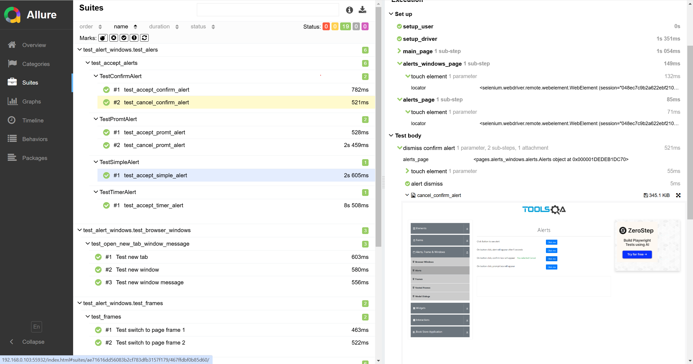
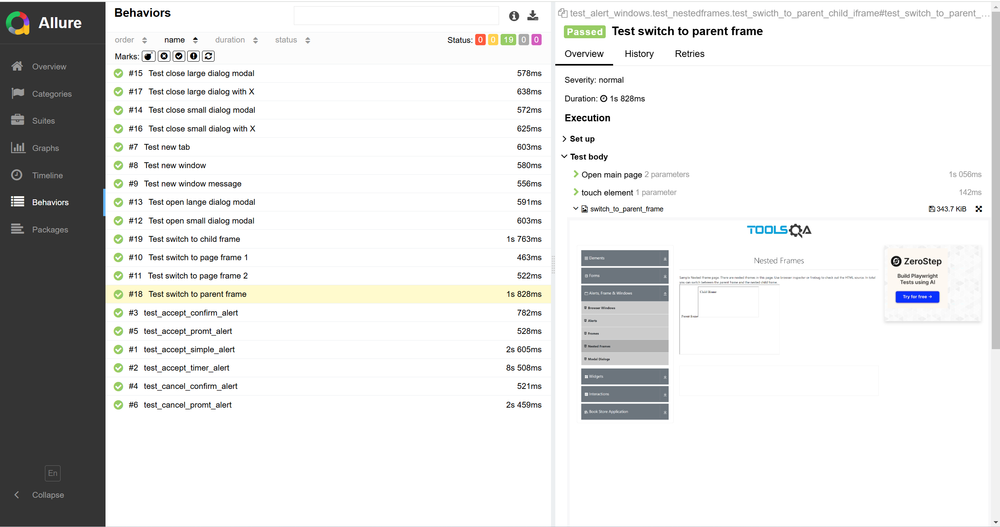

# Demo Tools QA
Что это? 

Это проект демонстрирующий архитектуру построения проекта по автоматизированному тестированию ui-части приложения.

---
Из чего состоит проект?

> base - описание базовых классов для автоматизации
> > driver.py  
> > user.py  
> > test_run.py
> 
> pages - описание страниц по POM
> > init.py   
> > alerts_windows  
> > books  
> > ...  
> > widgets
> 
> screenshots  
> >  
> >
> tests - описание тестовых сценариев  
> > allure-results 
> > > report_1  
> > > report_2  
> >
> > test_alerts_windows
> > > ...  
> > > test_1.py  
> >
> > test_books
> > > ...  
> > > test_n.py  
> >
> > test_widgets  
> > > ...
>
> utils - не относящиеся прямо к автоматизации программы  
> > address_validator.py 
> 
> readme.md - описание проекта  
> settings.py - общие настройки

По итогу проверки одного из ресурса, с использованием allure, получаем отчёт:

